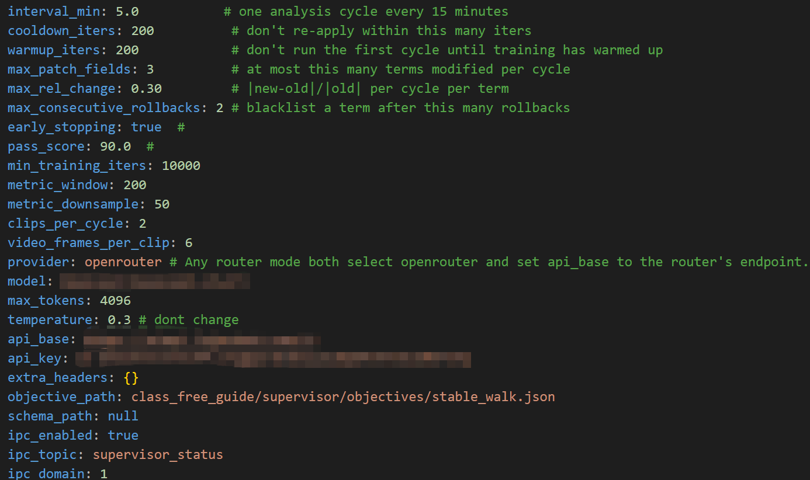

# Usage

## Demo Test

Use PPO train robot in mjlab

```bash

python class_free_guide/pineline/rl/script/train_fpo.py Unitree-Go2-Flat-FPO --num_envs 4096 --headless

```


Use FPO train robot in mjlab

```bash

python class_free_guide/pineline/rl/script/train_fpo.py Unitree-Go2-Flat-FPO --num_envs 4096 --headless

```

**PS:** 由于mjlab无法渲染batch的训练环境，因此训练无法直接可视化，若不使用无头模式`--headless`时候每隔100s生成一段4s的视频，位置在`losgs/rsl_rl/$Task_name/$Date/videos`

---

## Docker runtime env

对于不想在机器上安装相关依赖的人可以使用docker环境运行。

进入docker文件夹运行`build.sh`后执行`source ~/.bashrc`后输入`rl`进入容器即可。**注意：** 第一次运行需要先创建容器。

全部指令入下面所示：

```bash

# Step 1, build docker image
cd docker && ./build.sh

# Step 2, source bash env
source ~/.bashrc

#Step 3, go to container
rl # select (g)创建容器， then (s)启动， then (e)进入

```

- **PS:** 在第一次进入docker时会自动安装当前python库，因此不用再输入`pip install -e .`进行手动安装

---

## Supervior

- 使用LLM在线监督调参

```bash

python class_free_guide/pineline/rl/script/train_fpo.py Unitree-Go2-Flat-FPO --headless --num_envs 4096 --supervisor --supervisor_config [ custom supervisor.yaml path ]

```

- Router LLM refer configure 



### ⭐相关文档查看[Supervisor调参配置指南](class_free_guide/supervisor/doc/menu.md)

# TODO
